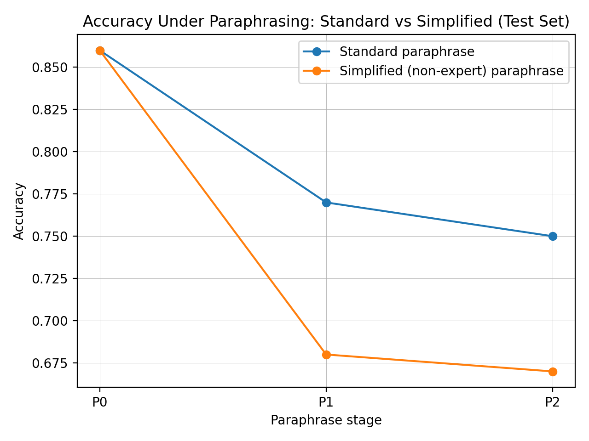
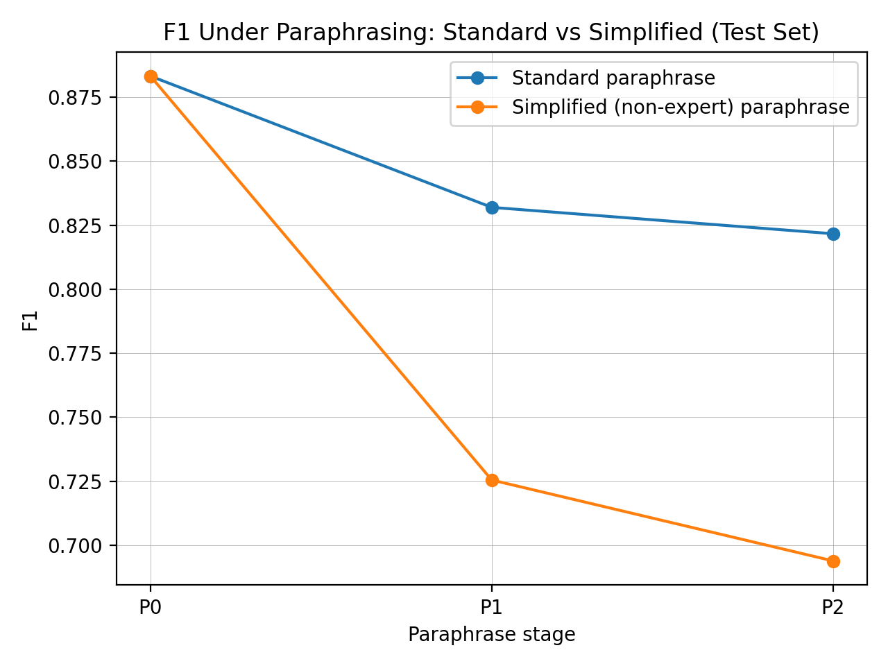
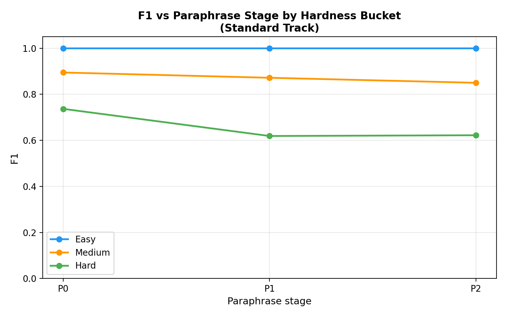
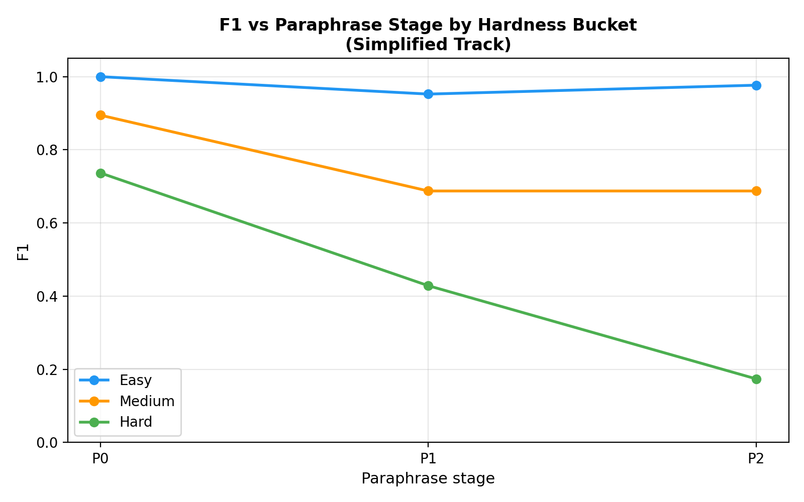

# Hardness-Aware Robustness of LLM Text Detection Under Iterative Paraphrasing

> **Mohammad Arifur Rahman** · rahman.arif.cse@gmail.com  
*Hardness-Aware Robustness of LLM-Text Detection Under Iterative Paraphrasing*

This project builds a fully local, end-to-end pipeline to study how well a classical detector can distinguish **human-written** from **LLM-generated** text when the LLM text is iteratively paraphrased. The central finding is **signature erosion**: detector performance degrades as paraphrasing increases, and the degradation is highly non-uniform — *hard* samples (those near the decision boundary) collapse first and fastest.

---

## Highlights

- **Balanced dataset:** 500 human + 500 LLM samples (100–200 words)
- **Two detectors:** Word TF-IDF (1–2 gram) + Char TF-IDF (3–5 gram), both with Logistic Regression
- **Robustness test:** same fixed test set evaluated under:
  - **P0:** original text
  - **P1 / P2:** one and two rounds of paraphrasing
- **Dual-track paraphrasing:** standard vs simplified (non-expert style)
- **Key result:** accuracy drops **0.86 → 0.79 → 0.77** (standard) and **0.86 → 0.72 → 0.70** (simplified)
- **Hardness finding:** Hard-bucket F1 collapses **0.737 → 0.174** under two rounds of simplified paraphrasing — a 76% relative drop invisible in aggregate metrics

---

## Results

### Baseline (P0 test)
- **Accuracy:** 0.8600
- **F1:** 0.8833

### Robustness Under Standard Paraphrasing

| Condition | n | Accuracy | Precision | Recall | F1 |
|---|---:|---:|---:|---:|---:|
| P0_test | 100 | 0.8600 | 0.9138 | 0.8548 | 0.8833 |
| P1_test | 100 | 0.7900 | 0.8333 | 0.8065 | 0.8197 |
| P2_test | 100 | 0.7700 | 0.7959 | 0.7742 | 0.7849 |

### Dual-Track Robustness: Standard vs Simplified Paraphrasing

We evaluate the same detector on the fixed test set under:
- **Standard paraphrasing** (P1/P2) — preserve meaning, reword only
- **Simplified paraphrasing** (P1/P2) — simpler vocabulary, shorter sentences, designed to amplify stylistic drift

**Key finding:** Simplified paraphrasing causes substantially stronger signature erosion than standard paraphrasing.

| Condition | n | Accuracy | Precision | Recall | F1 |
|---|---:|---:|---:|---:|---:|
| P0_test | 100 | 0.8600 | 0.9138 | 0.8548 | 0.8833 |
| P1_test_standard | 100 | 0.7900 | 0.8333 | 0.8065 | 0.8197 |
| P2_test_standard | 100 | 0.7700 | 0.7959 | 0.7742 | 0.7849 |
| P1_test_simplified | 100 | 0.7200 | 0.8667 | 0.6129 | 0.7183 |
| P2_test_simplified | 100 | 0.7000 | 0.9231 | 0.5484 | 0.6882 |




---

## Linguistic Drift (Test Only)

Paraphrasing causes measurable shifts in shallow style signals that directly explain signature erosion:

| Split | n | Words | Sents | Words/Sent | TTR | Punct rate |
|---|---:|---:|---:|---:|---:|---:|
| P0_test | 100 | 147.1 | 6.68 | 22.9 | 0.656 | 0.0184 |
| P1_test | 100 | 131.0 | 5.15 | 26.1 | 0.720 | 0.0178 |
| P2_test | 100 | 129.2 | 4.74 | 27.8 | 0.732 | 0.0170 |

- **Lexical diversity increases** (TTR): 0.656 → 0.720 → 0.732
- **Fewer but longer sentences**: words/sentence 22.9 → 26.1 → 27.8
- **Punctuation rate decreases** slightly

These shifts move LLM-generated text stylistically closer to human prose, directly eroding TF-IDF n-gram discriminability.

---

## Hardness-Aware Robustness (Easy / Medium / Hard Buckets)

We stratify the fixed test set into **Easy / Medium / Hard** tertiles using the baseline detector's **confidence margin** on P0_test:

```
margin_i = |p(y=LLM | x_i^P0) − 0.5|
```

Hard = low confidence (near decision boundary). Bucket assignments are fixed from P0 and applied to all paraphrase stages.

**Finding:** Degradation is not uniform. Hard samples collapse first, and simplified paraphrasing amplifies the gap dramatically.

| Bucket | n | P0 F1 | P1 std | P2 std | P1 sim | P2 sim |
|---|---:|---:|---:|---:|---:|---:|
| Easy | 33 | 1.000 | 1.000 | 1.000 | 0.952 | 0.977 |
| Medium | 33 | 0.895 | 0.872 | 0.850 | 0.688 | 0.688 |
| **Hard** | **34** | **0.737** | **0.619** | **0.622** | **0.429** | **0.174** |

> Hard-bucket F1 drops from **0.737 → 0.174** under P2 simplified paraphrasing.  
> Easy bucket remains ≥ 0.95 throughout all conditions.  
> Aggregate metrics completely hide this collapse.




**Key findings:**
- Under standard paraphrasing, Easy and Medium buckets are largely stable; Hard degrades moderately (0.737 → 0.622).
- Under simplified paraphrasing, Hard-bucket F1 collapses near chance level (0.174), while Easy remains robust.
- Robustness claims should always be reported stratified by detector-relative hardness, not only as aggregate metrics.

---

## Tech Stack

| Tool | Purpose |
|---|---|
| Python 3.11+ | core language |
| scikit-learn | TF-IDF, logistic regression, metrics |
| Ollama (`llama3.1:8b`) | local LLM generation and paraphrasing — no API keys |
| HuggingFace `datasets` | Wikipedia data streaming |
| matplotlib / seaborn | figures |
| statsmodels | McNemar's significance tests |
| numpy / pandas | data handling |

---

## Project Structure

```text
Analysis-of-Human-vs.-LLM-Generated-Text/
├── src/
│   ├── collect_human_wikipedia.py              # collect Wikipedia paragraphs (human)
│   ├── generate_llm_ollama.py                  # generate LLM paragraphs via Ollama
│   ├── topup_llm_ollama.py                     # top-up LLM samples if needed
│   ├── build_dataset.py                        # filter, dedup, build balanced P0
│   ├── repair_ids.py                           # fix duplicate IDs
│   ├── make_splits.py                          # fixed 80/10/10 train/val/test split
│   ├── train_detector.py                       # word TF-IDF (1-2gram) + LogReg
│   ├── train_char_ngram_detector.py            # char TF-IDF (3-5gram) + LogReg [NEW]
│   ├── paraphrase_test_only.py                 # standard P1/P2 paraphrases
│   ├── generate_paraphrase_test_simplified.py  # simplified P1/P2 paraphrases
│   ├── paraphrase_ollama.py                    # full-dataset paraphrasing (optional)
│   ├── evaluate_robustness.py                  # standard track robustness
│   ├── evaluate_robustness_test_dualtrack.py   # dual-track robustness
│   ├── evaluate_hardness_buckets_fixed.py      # hardness-stratified evaluation [FIXED]
│   ├── evaluate_auroc.py                       # AUROC + ROC curve figures [NEW]
│   ├── evaluate_bootstrap_ci.py                # 95% bootstrap CIs + McNemar tests [NEW]
│   ├── feature_drift.py                        # linguistic drift (standard track)
│   ├── feature_drift_extended.py               # drift for both tracks + by label [NEW]
│   ├── analyze_top_features.py                 # top discriminative n-gram features [NEW]
│   ├── error_analysis.py                       # confusion matrices + MCC + examples [NEW]
│   ├── plot_robustness.py                      # accuracy/F1 line plots
│   ├── plot_robustness_test_dualtrack.py       # dual-track comparison plots
│   └── plot_hardness_buckets.py                # hardness bucket F1 plots
├── data/
│   ├── raw_human/
│   │   └── human.jsonl                         # 500 Wikipedia paragraphs
│   ├── raw_llm/
│   │   └── llm.jsonl                           # 500 LLM-generated paragraphs
│   ├── processed/
│   │   └── all.jsonl                           # combined view (optional)
│   ├── p0/
│   │   └── p0.jsonl                            # balanced P0 dataset (1000 rows)
│   ├── p1/
│   │   ├── p1_test.jsonl                       # standard paraphrase round 1
│   │   └── p1_test_simplified.jsonl            # simplified paraphrase round 1
│   ├── p2/
│   │   ├── p2_test.jsonl                       # standard paraphrase round 2
│   │   └── p2_test_simplified.jsonl            # simplified paraphrase round 2
│   └── splits/
│       ├── train_ids.txt
│       ├── val_ids.txt
│       └── test_ids.txt
├── results/
│   ├── vectorizer.joblib                       # word TF-IDF vectorizer
│   ├── model.joblib                            # word n-gram LogReg model
│   ├── vectorizer_char.joblib                  # char TF-IDF vectorizer [NEW]
│   ├── model_char.joblib                       # char n-gram LogReg model [NEW]
│   ├── metrics_p0.json                         # baseline metrics on P0
│   ├── robustness_test.csv / .json             # standard track robustness
│   ├── robustness_test_dualtrack.csv / .json   # dual-track robustness
│   ├── hardness_buckets_test.csv / .json       # hardness-stratified results
│   ├── bootstrap_ci.csv / .json                # 95% CIs for all metrics [NEW]
│   ├── mcnemar_tests.csv                       # McNemar significance tests [NEW]
│   ├── auroc_summary.csv                       # AUROC per condition [NEW]
│   ├── top_features.csv                        # top discriminative n-grams [NEW]
│   ├── feature_survival.csv                    # feature weight drift [NEW]
│   ├── mcc_summary.csv                         # MCC per condition [NEW]
│   ├── feature_drift_test.csv                  # linguistic drift (standard)
│   └── feature_drift_extended.csv              # linguistic drift (both tracks) [NEW]
├── figures/
│   ├── accuracy_vs_paraphrase_test.png
│   ├── f1_vs_paraphrase_test.png
│   ├── accuracy_test_dualtrack.png
│   ├── f1_test_dualtrack.png
│   ├── f1_hardness_standard.png
│   ├── f1_hardness_simplified.png
│   ├── roc_curves_standard.png                 # [NEW]
│   ├── roc_curves_simplified.png               # [NEW]
│   ├── auroc_bar_comparison.png                # [NEW]
│   ├── top_features_bar.png                    # [NEW]
│   ├── feature_weight_drift.png                # [NEW]
│   ├── confusion_matrices.png                  # [NEW]
│   ├── mcc_trend.png                           # [NEW]
│   ├── drift_ttr_comparison.png                # [NEW]
│   └── drift_human_vs_llm_ttr.png             # [NEW]
├── run_all.sh                                  # one-command full pipeline [NEW]
├── requirements.txt
└── README.md
```

---

## Setup (Quick Start)

### Prerequisites
- Python 3.11+
- [Ollama](https://ollama.com) installed locally (no API keys required)
- Pull the model before running: `ollama pull llama3.1:8b`

### 1) Create environment + install dependencies

**Windows (PowerShell):**
```powershell
python -m venv .venv
.venv\Scripts\Activate.ps1
python -m pip install -U pip
pip install -r requirements.txt
```

**macOS / Linux:**
```bash
python -m venv .venv
source .venv/bin/activate
pip install -U pip
pip install -r requirements.txt
```

### Requirements

```
scikit-learn>=1.3
joblib
numpy
pandas
matplotlib
seaborn
requests
tqdm
datasets
statsmodels
```

---

## Reproduce

### Option A — one command

```bash
bash run_all.sh
```

Resume from a specific step (e.g. skip data collection if you already have data):

```bash
bash run_all.sh --from-step 5
```

### Option B — step by step

```bash
# 1. Collect data
python src/collect_human_wikipedia.py
python src/generate_llm_ollama.py

# 2. Build dataset
python src/build_dataset.py
python src/repair_ids.py
python src/make_splits.py

# 3. Train detectors
python src/train_detector.py
python src/train_char_ngram_detector.py

# 4. Generate paraphrases (test set only)
python src/paraphrase_test_only.py
python src/generate_paraphrase_test_simplified.py

# 5. Evaluate
python src/evaluate_robustness.py
python src/evaluate_robustness_test_dualtrack.py
python src/evaluate_hardness_buckets_fixed.py
python src/evaluate_auroc.py
python src/evaluate_bootstrap_ci.py

# 6. Analysis
python src/feature_drift.py
python src/feature_drift_extended.py
python src/analyze_top_features.py
python src/error_analysis.py

# 7. Plot
python src/plot_robustness.py
python src/plot_robustness_test_dualtrack.py
python src/plot_hardness_buckets.py
```

---

## Notes / Limitations

- Test set is small (n=100; ~33 per bucket). Per-bucket estimates carry variance — bootstrap CIs are reported in `results/bootstrap_ci.csv`.
- All text is Wikipedia-domain, 100–200 word paragraphs. Generalisability to other domains and lengths is untested.
- Generation and paraphrasing both use `llama3.1:8b`, which may introduce confounds.
- Only classical (TF-IDF) detectors are evaluated. Neural detectors may exhibit different hardness profiles.
- Robustness study uses test-only paraphrasing. A full P1/P2 (train+val+test) version is a natural extension.

---

## Possible Extensions

- Expand test set to n ≥ 300 for tighter per-bucket confidence intervals
- Paraphrase the full dataset (train + val + test) and compare training on P0 vs P0+P1 vs P1
- Add back-translation as a non-LLM paraphrase baseline
- Evaluate neural detector families (e.g. fine-tuned `roberta-base`) under the same harness
- Bucket-aware confidence calibration to reduce Hard-bucket FPR/FNR without retraining
- Evaluate across multiple local LLMs and temperature settings

---

## Citation

If you use this pipeline or results in your work, please cite:

```bibtex
@article{rahman2026hardness,
  title   = {Hardness-Aware Robustness of LLM-Text Detection Under Iterative Paraphrasing},
  author  = {Rahman, Mohammad Arifur},
  journal = {arXiv preprint},
  year    = {2026}
}
```

---

## License

MIT License. See `LICENSE` for details.
